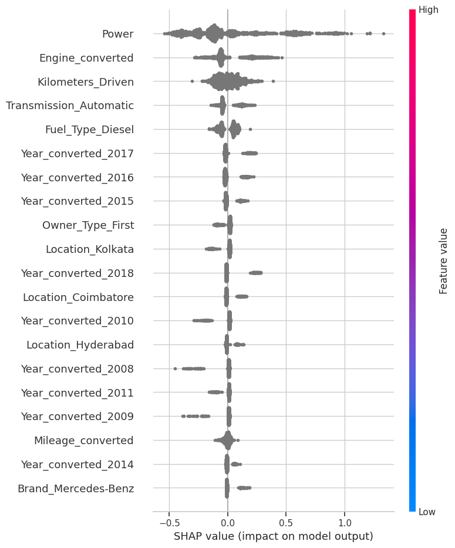
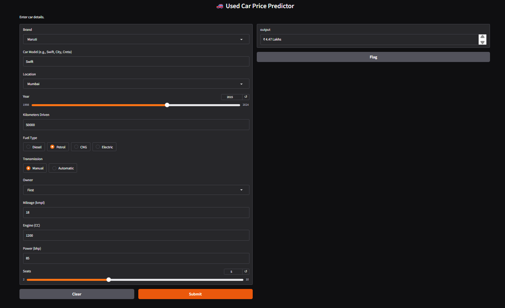

# 🚗 Used Car Price Predictor

## Project Overview
Buying a used car can be a tricky process due to the lack of transparent pricing. This project aims to bring transparency to the Indian used car market by building a machine learning model that predicts the **fair market price** of a car based on its features (Brand, Year, Kilometers Driven, Fuel Type, etc.).

The solution is an **End-to-End Machine Learning Pipeline** that processes raw data, engineers meaningful features, optimizes an XGBoost regressor, and serves predictions via an interactive web interface.

## Key Features
* **End-to-End Pipeline:** Automated data cleaning and preprocessing using Scikit-Learn Pipelines.
* **Advanced Modeling:** Utilized **XGBoost Regressor** for high accuracy on tabular data.
* **Hyperparameter Tuning:** Optimized model performance using **Optuna** (Bayesian Optimization).
* **Model Explainability:** Integrated **SHAP (SHapley Additive exPlanations)** to interpret *why* a car is priced a certain way.
* **Interactive Deployment:** Built a user-friendly web app using **Gradio/Streamlit** for real-time predictions.

## Tech Stack
* **Language:** Python
* **Libraries:** Pandas, NumPy, Scikit-Learn, Matplotlib, Seaborn
* **Machine Learning:** XGBoost, Random Forest
* **Optimization:** Optuna
* **Explainability:** SHAP
* **Deployment:** Gradio / Streamlit

## Dataset
The dataset contains information on 6000+ used cars sold in India.
* **Source:** [Kaggle / CarDekho]
* **Key Features:** `Name`, `Location`, `Year`, `Kilometers_Driven`, `Fuel_Type`, `Transmission`, `Owner_Type`, `Mileage`, `Engine`, `Power`, `Seats`.
* **Target Variable:** `Price` (in INR Lakhs).

## Project Workflow
1.  **Data Cleaning:** * Handled mixed data types (e.g., removing 'kmpl', 'bhp' units).
    * Imputed missing values (Median for Engine/Power, Mode for Seats).
2.  **Feature Engineering:**
    * Extracted **Brand** from Car Name.
    * Calculated **Car Age** (Current Year - Manufacturing Year).
    * Applied **Log Transformation** to the Target variable (`Price`) to handle skewness.
3.  **Model Training:**
    * Baseline: Linear Regression.
    * Advanced: XGBoost Regressor with Hyperparameter Tuning.
4.  **Evaluation:**
    * Metric: **RMSE** (Root Mean Squared Error) and **R2 Score**.

## Model Performance
After tuning hyperparameters with Optuna, the final XGBoost model achieved:
* **R2 Score:** ~0.85 (85% variance explained)
* **RMSE:** ~0.20 (Log Scale)
* *Interpretation: The model's predictions are typically within 15-20% of the actual market price.*

## 🖼️ Screenshots

### 1. Model Explainability (SHAP)
*Top features driving car prices:*

### 2. Web Interface
*User-friendly prediction app:*

## Future Improvements
* Scrape real-time data to keep prices current.
* Add a "Depreciation Graph" to show how value drops over time for specific models.
* Deploy the API using Docker and AWS/Render.
